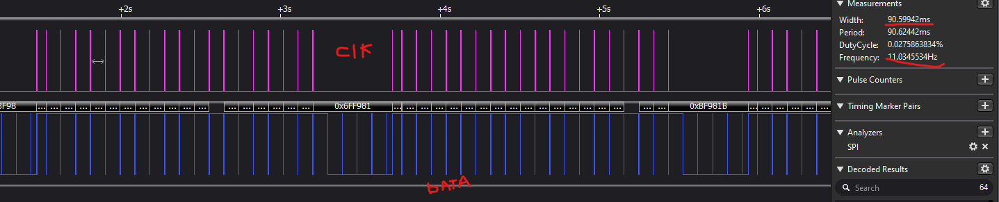
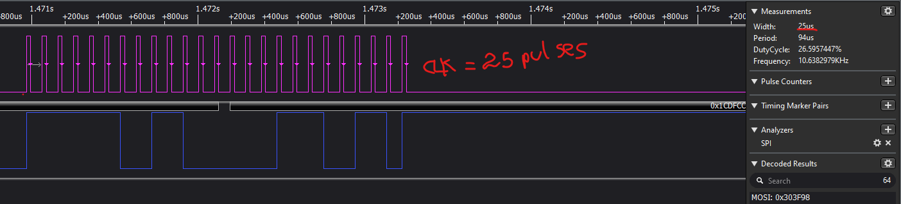
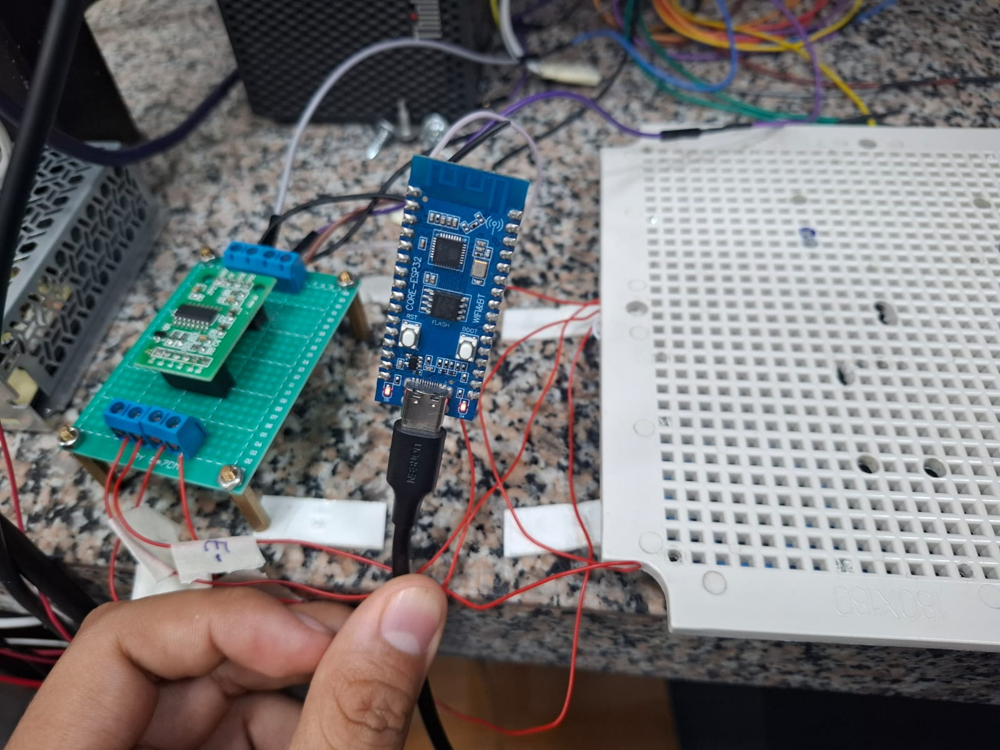
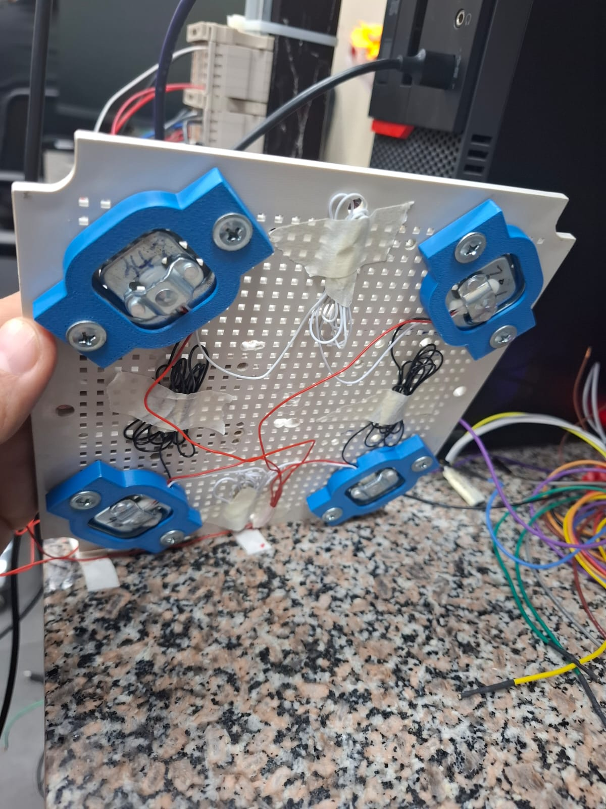

# HX711 LIBRARY
## Requirements
## Hardware
- ESP32C3(LUATOS DEV BOARD)
- HX711 MODULE
- LOAD CELLS x 4
## SOFTWARE
- ESP-IDF V5.4.1

### HOW TO USE 
- Define a GPIO PIN for the clock
- Define a GPIO PIN for read the data
- Define how many samples per reading will be averaged
- The basic example(main.c) first tare the system, then it prompts to place a known weight, which we have set by default to 213 g in the firmware. Once the known weight is placed, the algorithm automatically calculates the scale value and calibrates. After this process, the scale is ready for use.


```cmd
I (5236) MAIN: Procediendo a encerar...
I (6966) MAIN: Balanza encerada con el offset -207938
I (6966) MAIN: Procediendo a calibrar en 3 seg..
I (9966) MAIN: Coloque peso conocido ahora..
I (14706) MAIN: Balanza calibrada con escala -22.75
```
### Testing
- In the `main.c` we set 20 samples per reading. Between each sample there is a sampling time of 90 ms, since that is the time the HX711 needs to prepare the data. 

- To shift and read the bits for each sample, a high time of 25 µs and a low time of 60 µs are used


- System

- Digital scale 
